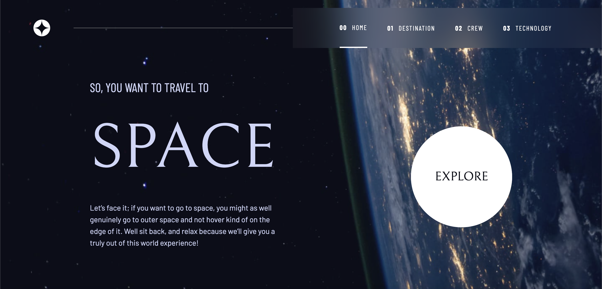

# space-tourism

This multi-page space tourism website displays information about various destinations, the crew and the different technologies available for space travel.

## Demo
[Live Demo](https://nc-space-tourism.netlify.app/)

## Built with
- TailwindCSS
- React
- React Router v6
- Vite

## Features
- [ ] View the optimal layout for each of the website's pages depending on their device's screen size
- [ ] See hover states for all interactive elements on the page
- [ ] View each page and be able to toggle between the tabs to see new information

## Lessons Learned
This was my first time working with TailwindCSS. I experienced a longer time styling the project as I am not yet familiar with the classes. However, I really enjoyed the utility first approach, making it easier to modify. I thoroughly enjoyed the mobile-design first. Up to this point, I had always built my projects for desktops first, but the responsive design features TailwindCSS provides makes it a seamless experience to create websites that look great on all devices and eliminates the need for complex media queries. Looking forward to creating more projects with this CSS framework!

## Running this Project Locally
From the repo:
1. Clone this project locally
2. Open the project in your preferred code editor
3. Open your terminal and `cd` to the project directory
4. Run `npm install` to install all relevant dependencies
5. Run `npm run dev` to start a dev server and view the project in your browser

## DevDependencies:
- React
- React Router DOM
- Vite
- autoprefixer
- PostCSS
- TailwindCSS
